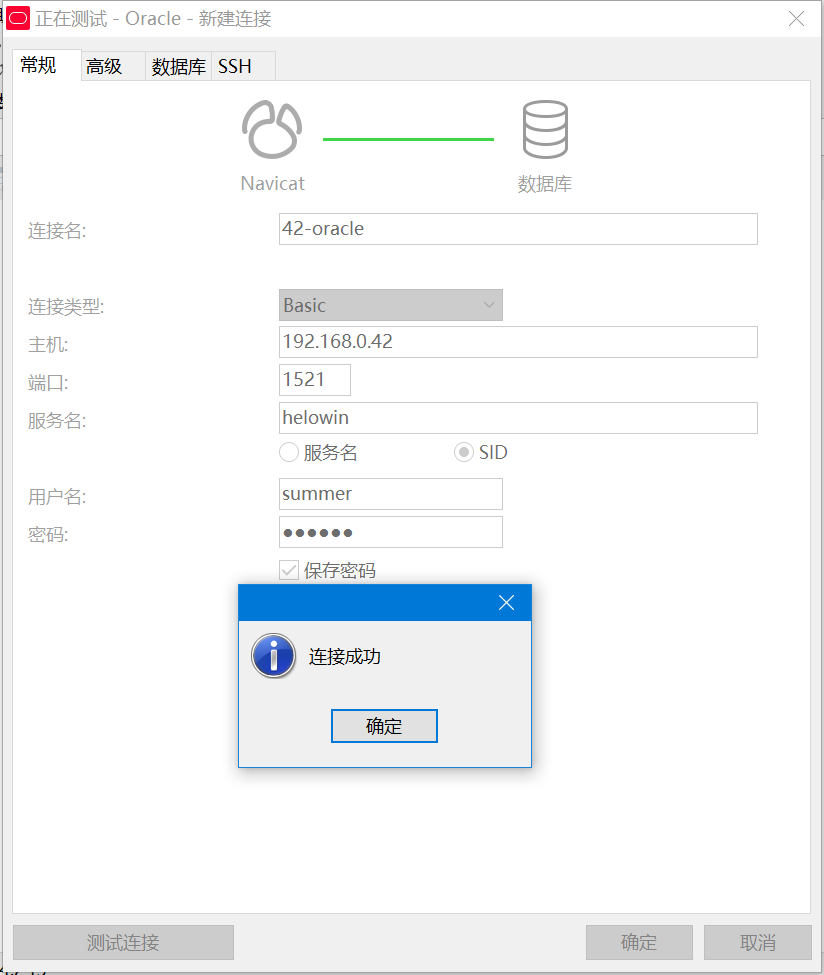
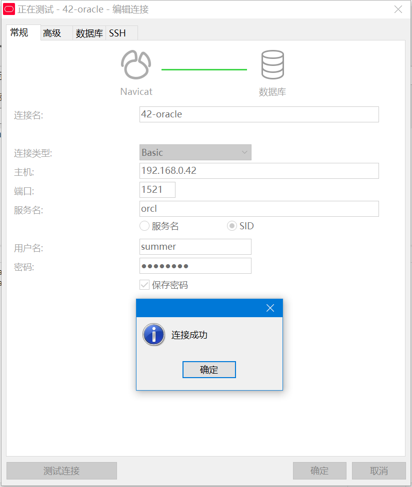

# docker安装oracle11g

## 目录

- [下载镜像](#下载镜像)

- [启动镜像](#启动镜像)

- [宿主机创建文件夹](#宿主机创建文件夹)

- [拷贝数据库文件至宿主机](#拷贝数据库文件至宿主机)

- [停止和删除容器](#停止和删除容器)

- [启动docker容器<映射数据文件>](#启动docker容器<映射数据文件>)

- [执行并完成基础设置](#执行并完成基础设置)

  - [1、进入容器](#1、进入容器)
  - [2、加载环境变量](#2、加载环境变量)
  - [3、登录](#3、登录)
  - [4、修改默认用户密码](#4、修改默认用户密码)
  - [5、创建表空间](#5、创建表空间)
  - [6、创建用户并指定表空间，授权](#6、创建用户并指定表空间，授权)

- [修改SID](#修改SID)

  - [1、关闭数据库](#1、关闭数据库)
  - [2、修改环境变量](#2、修改环境变量)

  


## 下载镜像

```bash
[root@smartops42 smartmining]# docker pull registry.cn-hangzhou.aliyuncs.com/helowin/oracle_11g
Using default tag: latest
latest: Pulling from helowin/oracle_11g
ed5542b8e0e1: Pull complete 
a3ed95caeb02: Pull complete 
1e8f80d0799e: Pull complete 
Digest: sha256:4c12b98372dfcbaafcd9564a37c8d91456090a5c6fb07a4ec18270c9d9ef9726
Status: Downloaded newer image for registry.cn-hangzhou.aliyuncs.com/helowin/oracle_11g:latest
registry.cn-hangzhou.aliyuncs.com/helowin/oracle_11g:latest
[root@smartops42 smartmining]# 
```


## 启动镜像

```bash
[root@smartops42 smartmining]# docker run -d --name oracle -p 1521:1521 registry.cn-hangzhou.aliyuncs.com/helowin/oracle_11g
513fcff2d2b17cedb091d92d5eb8c705ca874f78b6a27d7e65fabe0abed90ca1
[root@smartops42 smartmining]#
```


## 宿主机创建文件夹

```bash
[root@smartops42 smartmining]# mkdir -p /opt/oracle/
[root@smartops42 smartmining]# mkdir -p /opt/oracle/flash_recovery_area/
```


## 拷贝数据库文件至宿主机

```bash
[root@smartops42 smartmining]# docker ps -a
CONTAINER ID        IMAGE                                                  COMMAND                  CREATED             STATUS                      PORTS                    NAMES
513fcff2d2b1        registry.cn-hangzhou.aliyuncs.com/helowin/oracle_11g   "/bin/sh -c '/home/o…"   2 minutes ago       Up About a minute           0.0.0.0:1521->1521/tcp   oracle
[root@smartops42 smartmining]# docker cp 513fcff2d2b1:/home/oracle/app/oracle/oradata /opt/oracle/oradata
[root@smartops42 smartmining]# docker cp 513fcff2d2b1:/home/oracle/app/oracle/flash_recovery_area/helowin /opt/oracle/flash_recovery_area/helowin
[root@smartops42 smartmining]# chmod -R 777 /opt/oracle/
```


## 停止和删除容器

```bash
[root@smartops42 smartmining]# docker stop 513fcff2d2b1
513fcff2d2b1
[root@smartops42 smartmining]# docker rm  513fcff2d2b1
513fcff2d2b1
```


## 启动docker容器<映射数据文件>

```bash
[root@smartops42 smartmining]# docker run -d --name oracle_llg -p 1521:1521 -- privileged=true -v /opt/oracle/oradata:/home/oracle/app/oracle/oradata -v /opt/oracle/flash_recovery_area/helowin:/home/oracle/app/oracle/flash_recovery_area/helowin registry.cn-hangzhou.aliyuncs.com/helowin/oracle_11g
39721ba8b1dd97160d19018f7115eefe19439a3727a335c471fa88a56d2f3c88
```


## 执行并完成基础设置

### 1、进入容器

```bash
[root@smartops42 oracle]# docker ps 
CONTAINER ID        IMAGE                                                  COMMAND                  CREATED              STATUS              PORTS                    NAMES
39721ba8b1dd        registry.cn-hangzhou.aliyuncs.com/helowin/oracle_11g   "/bin/sh -c '/home/o…"   About a minute ago   Up About a minute   0.0.0.0:1521->1521/tcp   oracle_llg
[root@smartops42 oracle]# docker exec -it 39721ba8b1dd /bin/bash
[oracle@39721ba8b1dd /]$
```


### 2、加载环境变量

```bash
[oracle@39721ba8b1dd /]$ source /home/oracle/.bash_profile
[oracle@39721ba8b1dd /]$ su root 
Password: 
#密码：helowin
[root@39721ba8b1dd /]# vi /etc/profile
#在末尾添加
    export ORACLE_HOME=/home/oracle/app/oracle/product/11.2.0/dbhome_2
    export ORACLE_SID=helowin
    export PATH=$ORACLE_HOME/bin:$PATH
#刷新配置
[root@39721ba8b1dd /]# source /etc/profile
[root@39721ba8b1dd /]# su oracle
```

### 3、登录

```bash
[oracle@39721ba8b1dd /]$ sqlplus /nolog

SQL*Plus: Release 11.2.0.1.0 Production on Wed Nov 4 00:32:15 2020

Copyright (c) 1982, 2009, Oracle.  All rights reserved.

SQL> connect /as sysdba
Connected.
SQL> 
```


### 4、修改默认用户密码

```sql
SQL> alter user system identified by system;

User altered.

SQL> alter user sys identified by sys;

User altered.

SQL> ALTER PROFILE DEFAULT LIMIT PASSWORD_LIFE_TIME UNLIMITED;

Profile altered.

SQL>
```


### 5、创建表空间

```sql
SQL> create tablespace test datafile '/home/oracle/app/oracle/oradata/helowin/test.dbf' size 500M autoextend on next 50M maxsize unlimited;

Tablespace created.
```


### 6、创建用户并指定表空间，授权

```sql
SQL> create user summer IDENTIFIED BY 123456 default tablespace test;

User created.

SQL> grant connect,resource,dba to summer;

Grant succeeded.

SQL>
```

| **名称** | **参数** |
| :------: | :------: |
|    IP    | 宿主机ip |
|   端口   |   1521   |
|   SID    | helowin  |
|   账号   |  summer  |
|   密码   |  123456  |




## 修改SID

==**原来SID为helowin，先需要修改为orcl**==


### 1、关闭数据库

```sql
[oracle@39721ba8b1dd /]$ sqlplus /nolog

SQL*Plus: Release 11.2.0.1.0 Production on Wed Nov 4 01:00:41 2020

Copyright (c) 1982, 2009, Oracle.  All rights reserved.

SQL> connect /as sysdba
Connected.
SQL> shutdown immediate
Database closed.
Database dismounted.
ORACLE instance shut down.
SQL>
```


### 2、修改环境变量

```sql
[oracle@39721ba8b1dd /]$ vi /home/oracle/.bash_profile
#更改
ORACLE_SID=orcl;export ORACLE_SID
[oracle@39721ba8b1dd /]$ cat /etc/oratab
orcl:/home/oracle/app/oracle/product/11.2.0/dbhome_2:Y
[oracle@39721ba8b1dd /]$ cd $ORACLE_HOME/dbs
[oracle@39721ba8b1dd dbs]$ ll
total 32
-rw-r-----. 1 oracle oinstall 3584 Jan  4  2016 123.sp
-rw-rw----. 1 oracle oinstall 1544 Nov  4 01:01 hc_helowin.dat
-rw-r--r--. 1 oracle oinstall 2851 May 16  2009 init.ora
-rw-r--r--. 1 oracle oinstall 1067 Jan  4  2016 inithelowin.ora
-rw-r-----. 1 oracle oinstall   24 Aug 23  2014 lkHELOWIN
-rw-r-----. 1 oracle oinstall   24 Dec 29  2015 lkORCL
-rw-r-----. 1 oracle oinstall 2048 Nov  4 00:33 orapwhelowin
-rw-r-----. 1 oracle oinstall 3584 Nov  4 00:25 spfilehelowin.ora
[oracle@39721ba8b1dd dbs]$ mv hc_helowin.dat hc_orcl.dat 
[oracle@39721ba8b1dd dbs]$ mv orapwhelowin orapworcl    
[oracle@39721ba8b1dd dbs]$ mv spfilehelowin.ora spfileorcl.ora 
[oracle@39721ba8b1dd dbs]$ mv lkHELOWIN lkORCL
[oracle@39721ba8b1dd dbs]$ exit
exit
[root@39721ba8b1dd /]# exit
exit
[oracle@39721ba8b1dd /]$ exit
exit
[root@smartops42 oracle]# docker ps
CONTAINER ID        IMAGE                                                  COMMAND                  CREATED             STATUS              PORTS                    NAMES
39721ba8b1dd        registry.cn-hangzhou.aliyuncs.com/helowin/oracle_11g   "/bin/sh -c '/home/o…"   49 minutes ago      Up 49 minutes       0.0.0.0:1521->1521/tcp   oracle_llg
[root@smartops42 oracle]# docker restart 39721ba8b1dd
39721ba8b1dd

```




